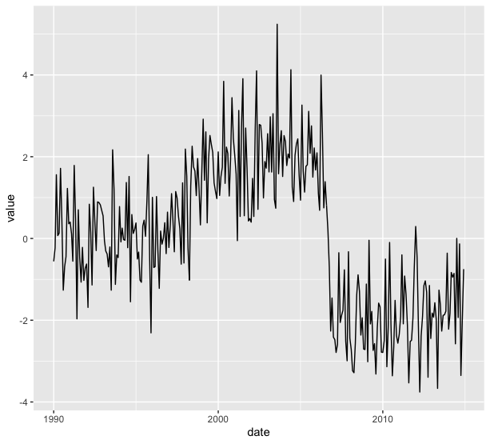

# Description

R Code for the paper "Declining fisheries and increasing prices: The economic cost of tropical rivers impoundment" by Maria Alice Leite Lima, Adriana Rosa Carvalho, Marcus Alexandre Nunes, Ronaldo Angelini e Carolina Rodrigues da Costa Doria. The paper was published on Fisheries Research, Volume 221, January 2020, 105399, [https://doi.org/10.1016/j.fishres.2019.105399](https://doi.org/10.1016/j.fishres.2019.105399)

This code uses one of Bai and Perron (2003) methods to find structural breaks in times series' means. 

# Usage

The most important file in this repository is `StructuralBreak.R`. This function estimates the break points for the time series and their confidence intervals. Besides that, it plots the data histogram, the fitted model, and calculates the sample mean for each part of the time series. It also provides the BIC calculations in order to report the best fitted model.

Below you can find an example showing how to use this function. 

```r
# packages needed

library(ggplot2)
library(lubridate)
library(scales)

# import data into R

example <- read.csv(file = "example.csv")

# convert date

example$date <- ymd(example$date)

# time series plot

ggplot(example, aes(x = date, y = value)) +
  geom_line()
```



```r
# running the code

StructuralBreak(example)
[[1]]
  BP       BIC
1  0 1216.7517
2  1  977.2670
3  2  845.9409
4  3  853.4964
5  4  861.6767
6  5  872.5690

[[2]]
        Inf Lim      Break        Sup Lim     
Break 1 "1997-12-01" "1998-04-01" "1998-07-01"
Break 2 "2006-08-01" "2006-09-01" "2006-10-01"

[[3]]
Sub-series 1 Sub-series 2 Sub-series 3 
  0.09040591   1.87568446  -1.90052828
```


The output `[[1]]` shows the BIC values. With this table the user can see how many breakpoints are in the time series. In this example, we can see the minimum BIC is 845.9409, which gives us 2 breakpoints.

`[[2]]` shows the date where each breakpoint is and its respective 95% confidence interval.

Finally, `[[3]]` informs the mean for each sub-series.


# References

Bai, J., Perron, P., 2003. "Computation and analysis of multiple structural change models". *J. Appl. Econom*. **18**, 1–22. https://doi.org/10.1002/jae.659