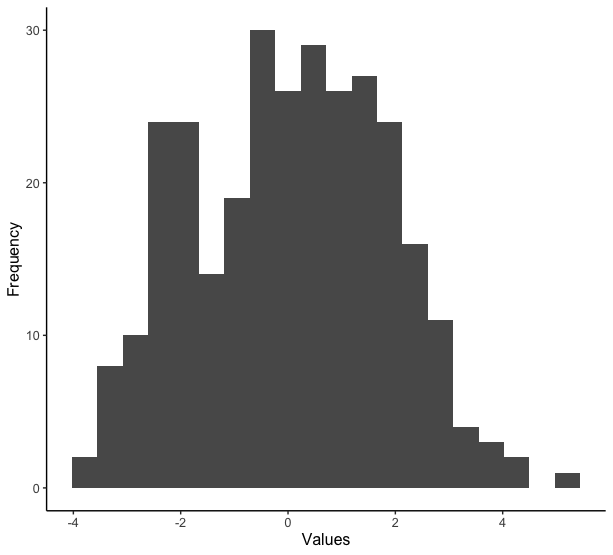
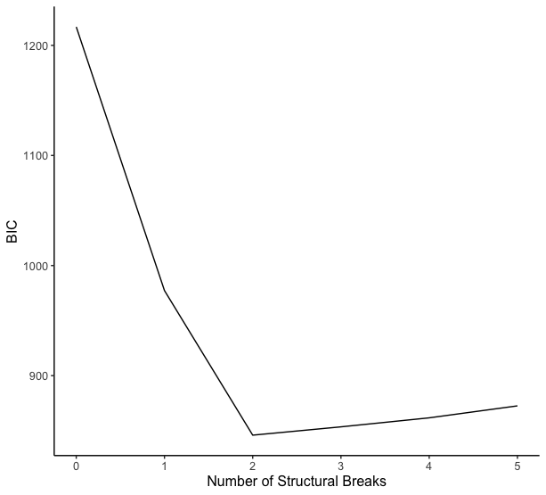

# Description

R Code for the upcoming paper "Declining fisheries and increasing prices: the economic cost of tropical rivers impoundment" by Lima, M. A. L. L., Carvalho, A. R., Nunes, M. A., Angelini, R., and Doria, C. R. C. 

This code uses one of Bai and Perron (2003) methods to find structural breaks in times series' means. 

# Usage

Function `StructuralBreak` estimates the break points and their confidence intervals. Besides that, it plots the data histogram, the fitted model, and calculates the sample mean for each part of the time series. It also provides the BIC calculations in order to report the best fitted model.

You can find an usage example with simulated data below.

```r
library(ggplot2)
set.seed(123)
mock_data <- data.frame(x = seq.Date(from=ymd("2017-01-01"), 
                                     length.out = 300, 
                                     by = "1 day"), 
                        y = c(rnorm(100), rnorm(100, 2), rnorm(100, -2)))
    
ggplot(mock_data, aes(x = x, y = y)) +
  geom_line()
```


```r
StructuralBreak(mock_data)
[[1]]
  BP       BIC
1  0 1216.7517
2  1  977.2670
3  2  845.9409
4  3  853.4964
5  4  861.6767
6  5  872.5690

[[2]]
        Inf Lim      Break        Sup Lim     
Break 1 "2017-04-06" "2017-04-10" "2017-04-13"
Break 2 "2017-07-19" "2017-07-20" "2017-07-21"

[[3]]
Sub-series 1 Sub-series 2 Sub-series 3 
  0.09040591   1.87568446  -1.90052828
```







# References

Bai, J., Perron, P., 2003. "Computation and analysis of multiple structural change models". *J. Appl. Econom*. **18**, 1–22. https://doi.org/10.1002/jae.659